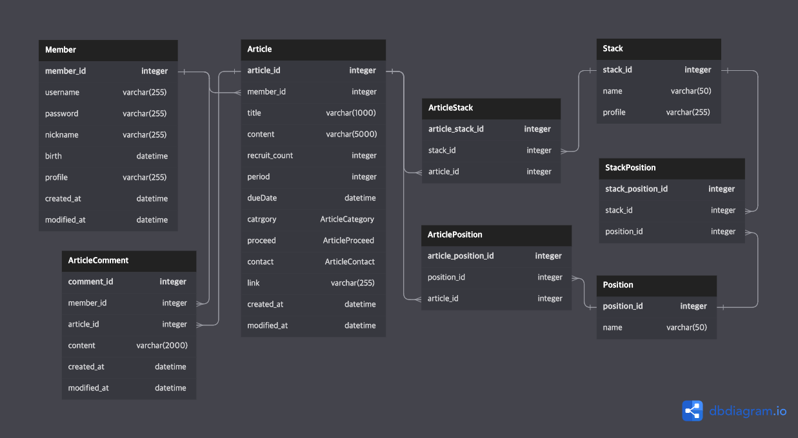

# Hamkke Study Service

같이 공부하기위한 스터디원 또는 프로젝트 팀원을 모집하고 참여할 수 있도록 게시판 서비스를 제공합니다.

<br/>

## Contact Me

devquokkajeong@gmail.com

<br/>

## Deploy

- Client: #URL
- ApiDoc: #URL

<br/>

## Start

사전에 Docker 설치 및 실행이 필요합니다.

또한 환경변수 설정이 필요합니다. `.env.example` 파일을 참고하여 `.env.development` 파일을 생성하여 실행해주세요.

궁금한 정보가 있다면 상단에 있는 이메일로 연락을 부탁드립니다.

```bash
docker-compose up
```

<br/>

## Function

### 회원 기능

- 회원가입
- 로그인
- 소셜 로그인 (구글, 깃허브, 카카오)
- 마이 페이지 기능
  - 대시보드에서 차트를 통하여 내가 작성한 글과 댓글 수 확인
  - 회원정보 수정 및 탈퇴
  - 내가 작성한 게시글
  - 내가 작성한 댓글
- 쪽지 기능

### 게시글 기능

- 정렬 (페이지네이션)
- 검색
- 추가, 수정, 삭제

### 관리자 기능

- 회원 정보 관리
- 스택(기술) 관리
- 게시글 관리
- 댓글 관리

<br/>

## API Document with google sheets

- url: https://docs.google.com/spreadsheets/d/1rVgIc10vi8zEuND1T4phQ7NftSKmksAatBpXEFtNBXY/edit?usp=sharing

<br/>

## Table Document


<br/>

## ER-Diagram


